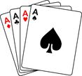
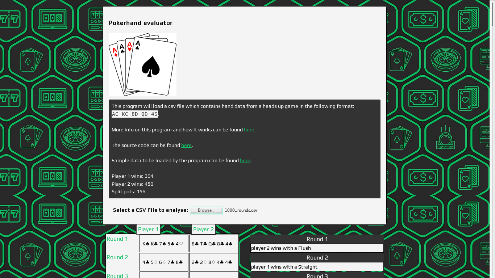

## Heads up poker-evaluator 

This program will load a csv files which contains hand data from a head up game in the following format:

```AC KC 8D QD 5S```

* A = Ace || 14
* K = King || 13
* Q = Queen || 12
* J = Jack || 11
* T = 10

- C = ♣ || clubs
- H = ♡ || hearts
- S = ♠ || spades
- D = ♢ || diamonds

> Note : The spacing is important. If the space between suits and values is different the iterations of the loops that separate suits from values can be changed in ```config.js```, the default is a step of three.

The above hand will be rendered as:

```A♣ K♣ 8♢ Q♢ 5♠```

The program first loads the CSV file turns it into text and then creates an array of arrays the inner arrays have two values representing the hands of a round, it looks something like this:

```[[ "A♣ K♣ 8♢ Q♢ 5♠" , "8♣ T♣ K♣ 8♣ 4♣"], ["K♠ K♡ K♣ 8♠ 7♠", "K♠ K♣ 7♠ 5♣ 4♡"], ["2♣ 2♡ 2♠ 4♣ 6♣", "K♠ Q♠ K♣ Q♣ K♡"]] etc...```


Each inner array is passed into the ```getRoundData``` which can been seen in the ```main function calls``` section.

```getRoundData``` separates the suits from values and then passes these into ```getHand``` which checks for a suit, a straight, a match then appends that data to the ```hand``` object which is true or false. The hand object is then pushed into an array of arrays which has the same positions as the orginal data.

> Note : An Ace can be high or low and wraps in the case of a wheel ( A - 5 ).

The hand is also given a rank in ```getRank``` which gives the hand a rank from 1 - 10

That hand data is then evaluated by the ```outputWinners``` function which determines which hand is the winner of the round by first looking at the rank and then looking at additonal information such as ```hand.highCard``` or the highest value of ```hand.values``` to decide on a winner, if all these values are equal then it is a split pot.

> Note : ```outputWinners``` is a little large and ugly as edge cases are also considered i.e when a their are two straights or both hands have pairs.

The initial data is also output into a table by the ```drawOutput``` function. The winners of that round are then displayed to right of the table like so:



> licensed cc-by-sa [Adam Harpur](https://www.adamharpur.com) 2017
